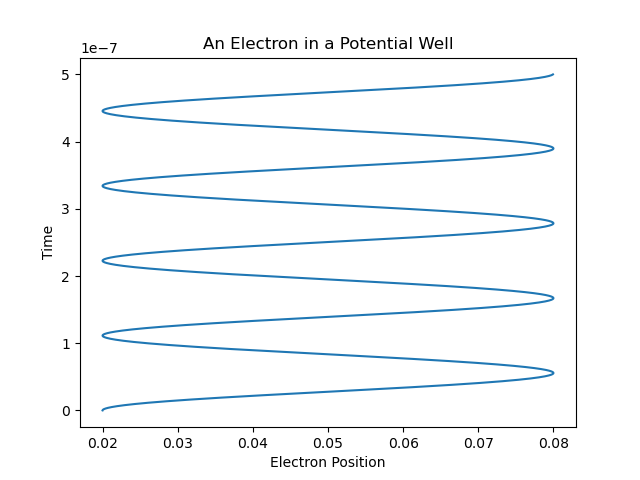
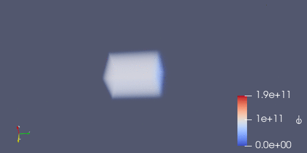

## Rust Plasma Simulation Examples

This repository contains a set of basic plasma physics simulations implemented based on Lubos Brieda's *Plasma Simulations by Example*.

The author of the book [provides simulation code](https://github.com/particleincell/plasma-simulations-by-example) written in C++, but here the simulations have been re-implemented in Rust. I undertook this project to challenge myself and to better internalize the computational physics concepts outlined in the book.

### Book

*Plasma Simulations by Example* by Lubos Brieda can be found [here](https://www.amazon.com/gp/product/1138342327). As a disclaimer, I am not associated with the author and I have not been paid to promote this book. I find the text to be a useful resource for understanding the basics of computational plasma physics. The author is duly credited, as this repository represents a fair use derivative work of the author's original C++ simulation code.


### Building and Installation

#### Rust

The code can be built and installed in a Docker container by running the following command:

```
docker build -t plasma .
```

Outside of Docker, the code can be built and installed via the standard Cargo methodology:

```
cargo build --release
cargo install --path .
```

Note that installation is not necessary if you simply wish to run the executable, following the build, from the `target` directory within the directory containing the cloned repository.

#### Python

Python is used for generating any plots associated with the simulations. The dependencies necessary for generating these plots can be installed via the following command:

```
pip install -r requirements.txt
```

#### ParaView

[ParaView](https://www.paraview.org/) is an open-source, multi-platform data analysis and visualization application. The book uses it for visualization the original C++ simulations, so we continue this practice here. Besides being used in the book, ParaView stands on its own as a useful visualization tool. Download instructions are provided [here](https://www.paraview.org/download/).

### Simulations

Those simulations which have been implemented so far are listed below, with instructions for how to execute them and examples of the resulting artifacts.

#### Chapter 1 - Single Particle in 1-D Space

A single electron trapped in a one dimensional potential well. The electron oscillates back and forth within the well, in a quest to balance the positive charge with the regions where it doesn't currently reside.

The simulation can be run via Docker, as follows:

```
docker run -it --rm -v $(pwd):/usr/src/plasma-simulation --name plasma plasma single-particle
```

The simulation can be run using Cargo, as follows:

```
cargo run --release -- single-particle
```

A trace of the electron and the potential/kinetic energy of the system is written to `trace.csv`.

Below is a plot which shows the electron's position over time:



This plot can be generated by running `python plots/single_particle_trace.py`. See the building and installation section for details on installing the Python dependencies required for this script.

#### Chapter 2 - Multiple Particles in Grounded Box

Many electrons and oxygen ions are distributed within a three dimensional box that has reflective sides. The electron cloud starts in one octant of the box and oscillates back and forth in an attempt to reach equilibrium. This is an electrostatic environment, so no magnetic field calculations are involved.

The simulation can be run via Docker, as follows:

```
docker run -it --rm -v $(pwd):/usr/src/plasma-simulation --name plasma plasma grounded-box
```

The simulation can be run using Cargo, as follows:

```
cargo run --release -- grounded-box
```

The simulation periodically outputs files containing data on the electron/ion density, electric field, potential, and charge density at different times. Upon creation, the files are stored in the `results` directory. These files are written in the VTI format, which allows our simulation to be viewed via a visualization tool called Paraview.

Below is an animation of the simulation running in ParaView:



The animation displays electron density over time.

### Testing

Tests can be run via Docker using the following command:

```
docker run --entrypoint=/bin/sh plasma -c "cargo test"
```

Tests can be run outside of Docker as follows:

```
cargo test
```

### Code Formatting

All Rust code must be formatted by applying the `rustfmt` command.
